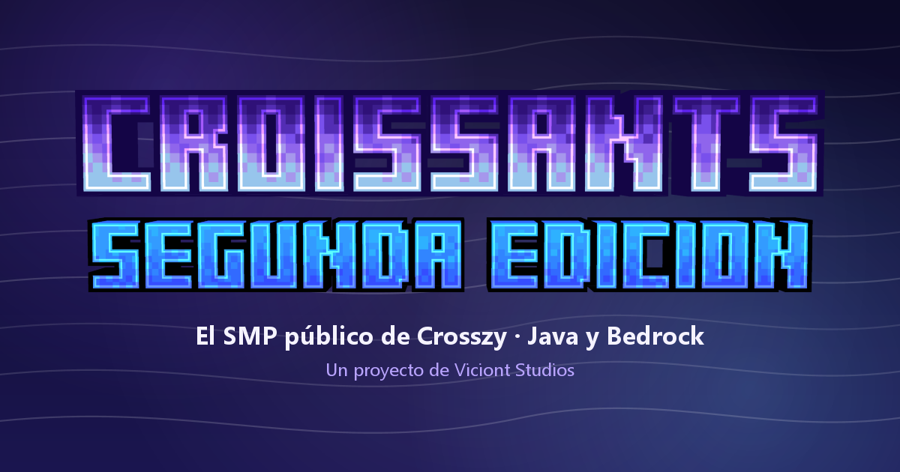

<p align="center">
  <a href="https://crissyjuanxd.github.io/Croissants-Web/">
    
  </a>
</p>

<h1 align="center">Croissants Segunda Edición</h1>

<p align="center">
  <b>La web del SMP público de <a href="https://www.twitch.tv/crosszy">Crosszy</a> para Java y Bedrock.</b><br>
  Un proyecto de <a href="https://viciontstudios.pages.dev/"><b>Viciont Studios</b></a>.
</p>

<p align="center">
  🌐 <a href="https://crissyjuanxd.github.io/Croissants-Web/"><b>crissyjuanxd.github.io/Croissants-Web</b></a>
</p>

---

## La web

| Sección | Qué hay |
| --- | --- |
| **Inicio** | IP de Java y Bedrock, jugadores conectados en vivo, el día de la temporada, cómo empezar, lo destacado, el calendario y los últimos anuncios. |
| **Guía** | Cómo jugar desde el primer día: conectarse (con el launcher se entra directo, sin IP), el `/menu` y sus menús con imágenes, DinoCoins, misiones, trabajos, habilidades, homes, protecciones, casino, pesca, tumbas, rangos, Twitch y comandos. |
| **Misiones** | Las misiones normales, extra y de trabajo como cajas. Las abiertas muestran qué piden y el cofre de recompensa igual que en el juego; las demás salen como *misión bloqueada*. |
| **Cambios y Jugabilidad** | Qué desbloquea cada cambio (`/changes uno`, `extra`, `dos`, `tres`), cómo se juega cada dimensión (Overworld, BloodMoon, Warden Cave, End), los jefes, los mobs, todos los crafteos en su mesa y los items con el tooltip del juego. |
| **Jugadores** | Todos los jugadores con sus misiones, DinoCoins, trabajos, habilidades, horas jugadas y estadísticas. |
| **Anuncios** | Las novedades del servidor escritas desde el panel, cada una con su propia página. |
| **Launcher** | Enlace a la descarga oficial del **Viciont Studios Launcher**. |

**Características**

- 🌬️ Fondo con las capturas del servidor pasando despacio y una bruma de viento suave en **WebGL**.
- 🧱 Items, tooltips, mesas de crafteo, alto horno, herrería y el cofre de las misiones dibujados como en Minecraft (con los códigos de color del juego).
- 📡 **Conectada con el servidor**: las misiones activas, los cambios, los jugadores y el catálogo del juego se actualizan solos.
- 🛠️ **Panel de administración** en `/admin/` para cambiar textos, imágenes, secciones y anuncios sin tocar código.
- 📱 Responsive y accesible (teclado, foco controlado y “reducir movimiento”).

## Datos en vivo desde el plugin

QuasoPlugin sube tres archivos a un repositorio aparte ([CrissyjuanxD/Croissants-Live](https://github.com/CrissyjuanxD/Croissants-Live)) y avisa al instante por [ntfy.sh](https://ntfy.sh) con el commit nuevo. La web los lee directamente de ahí; no hace falta volver a publicar la web.

| Archivo | Qué trae | Cuándo se sube |
| --- | --- | --- |
| `estado.json` | Día, misiones activas, cambios activos y quién está conectado | En cuanto cambia (se revisa cada 15 s) |
| `catalogo.json` | Items, mobs, misiones, crafteos, trabajos y habilidades tal como están en el plugin | Al prender el servidor y con `/web subir` |
| `jugadores.json` | Las estadísticas de cada jugador | Cada 2 minutos si algo cambió |

Así, **si creas, cambias o borras un item, un mob, una misión, un crafteo, un trabajo o una habilidad en el plugin, la web se actualiza sola**. Lo que es solo de la web (texturas, descripciones, imágenes, notas) se edita en el panel y nunca lo pisa el plugin.

**Configurar el plugin (una vez):** crea un *fine-grained token* de GitHub con acceso solo a `Croissants-Live` y el permiso **Contents: Read and write**, pégalo en `plugins/QuasoPlugin/config.yml` (sección `web:`, con `activado: true`) y usa `/web recargar`. `/web` muestra el estado de la conexión.

## Panel de administración

Todo el contenido vive en [`data/`](data) y se edita desde **`/admin/`**:

- **Acceso seguro:** se entra con un token de GitHub con permiso de escritura en este repositorio. La web es estática y GitHub autoriza cada cambio.
- **Borrador y vista en vivo:** los cambios se guardan como borrador en tu navegador y se ven en la web en tiempo real (al lado del panel o en otra pestaña) antes de publicarlos.
- **Publicar:** crea un commit con los textos y las imágenes optimizadas (`assets/uploads/`). La web se actualiza en 1-2 minutos y las páginas abiertas se recargan solas.
- **Historial:** cada publicación queda guardada y se puede volver a cualquier versión.

## Estructura

```
├── index.html              La web (una sola página con rutas #inicio, #guia, #misiones…)
├── admin/index.html        Panel de administración
├── 404.html                Página de error
├── data/
│   ├── sitio.json          Textos, guía, cambios, dimensiones, jefes, IPs y redes
│   ├── juego.json          Copia del catálogo del plugin + texturas y descripciones de la web
│   └── anuncios.json       Los anuncios
├── assets/
│   ├── css/                base.css · site.css · admin.css
│   ├── js/                 app.js (web) · live.js (datos en vivo) · mc.js (items y mesas de Minecraft)
│   │   ├── views/          Una vista por sección
│   │   └── admin/          El panel (main.js, tabs.js, kit.js)
│   ├── img/                Logos, fondos, capturas del launcher e íconos
│   ├── textures/           Texturas vanilla de los items
│   └── uploads/            Imágenes subidas desde el panel
└── tools/                  Scripts para generar el contenido inicial y las texturas
```

Sin dependencias ni proceso de compilación: HTML, CSS y JavaScript (módulos ES).

## Publicar

**GitHub Pages:** se publica sola desde la rama `main` (carpeta raíz).

**Cloudflare Pages:** *Create a project → Connect to Git →* este repositorio, sin comando de build y con `/` como carpeta de salida. `_headers` ya trae las cabeceras de seguridad. Si cambias de dominio, actualiza `og:url`, `og:image` y `canonical` en `index.html`, y la dirección de `robots.txt` y `sitemap.xml`.

## Probar en local

```bash
python -m http.server 8000
```

Abre <http://localhost:8000>. El panel se puede probar sin token en <http://localhost:8000/admin/?prueba> (no sube nada).

---

<p align="center">
  Página creada por <a href="https://github.com/CrissyjuanxD"><b>CrissyjuanxD</b></a> · <a href="https://viciontstudios.pages.dev/">Viciont Studios</a><br>
  <sub>No afiliado a Mojang Studios ni a Microsoft. Minecraft es una marca de Mojang Studios.</sub>
</p>
